# Introduction

The rise of e-commerce platforms and the evolution of global trade
logistics have propelled online shopping into mainstream adoption,
giving customers the ease of swiftly purchasing products with just a few
clicks. This dataset comprises 10,999 observations across 12 variables,
and the forthcoming analysis will delve into the dynamics of
international shipping.

# Key Findings:

-   The customer base is fairly evenly distributed between males (49.6%)
    and females (50.4%).
-   Warehouse Block F stands out as the busiest among the five
    warehouses, with the highest number of orders shipped out, totaling
    3666.
-   The ship is the predominant mode of shipment across all warehouses
    and overall.
-   All orders necessitate at least two customer care calls, with the
    highest recorded at seven for a single order.
-   Warehouse Block F also registers the highest total number of
    customer care calls.
-   Shipments made by ships generate the highest total number of
    customer care calls.
-   The proportions of product valuations, categorized by cost, are
    notably similar across various shipment modes, indicating no clear
    preference based on product price.
-   Warehouse Block D boasts the highest average customer rating of
    3.02.
-   The overall mean customer rating stands at 3.00, with a median of
    2.99.
-   Shipments by road receive the highest average customer ratings,
    averaging at 3.00.
-   Similar to product valuation, the proportions of products
    distinguished by importance exhibit little variance across different
    shipment modes, suggesting no discernible preference based on
    product importance.
-   Discounts offered range from a minimum of 1% to a maximum of 65%.
-   The majority of customers received discounts between 1% and 10% on
    their purchases.
-   No correlation is observed between the discount amount and customer
    ratings. The highest average customer rating is 3.06 for products
    with a discount range of 11% to 20%, while the lowest average
    customer rating is 2.85 for products with a discount range of 61% to
    70%.
-   The average weight of products is 3634g, with a median of 4149g.
-   No discernible preference for a particular mode of shipment is
    evident based on the weight of products.
-   All warehouses experience a higher proportion of late shipments
    compared to on-time shipments.
-   Warehouse Block B has the highest proportion of late shipments, at
    60.2%.
-   Shipments by flight also exhibit the largest proportion of late
    shipments, at 60.2%.
-   Interestingly, the average customer rating for late shipments (3.01)
    surpasses that for on-time shipments (2.97), suggesting that
    customer ratings are not significantly influenced by the punctuality
    of shipped products.
-   Products deemed of high importance experience a greater proportion
    of late shipments (65%) compared to on-time shipments (35%).

# Analysis

## Load data and import libraries

    #load data 
    shippingdf <- read.csv("~/Case Studies/Shipping Case Study/Shipping_Analysis/shipping.csv")

    #import library
    library('stringr')
    library('dplyr')

    ## 
    ## Attaching package: 'dplyr'

    ## The following objects are masked from 'package:stats':
    ## 
    ##     filter, lag

    ## The following objects are masked from 'package:base':
    ## 
    ##     intersect, setdiff, setequal, union

    library('ggplot2')
    library('magrittr')
    library('patchwork')
    library('gridExtra')

    ## 
    ## Attaching package: 'gridExtra'

    ## The following object is masked from 'package:dplyr':
    ## 
    ##     combine

## Check data structure

    str(shippingdf)

    ## 'data.frame':    10999 obs. of  12 variables:
    ##  $ ID                 : int  1 2 3 4 5 6 7 8 9 10 ...
    ##  $ Warehouse_block    : chr  "D" "F" "A" "B" ...
    ##  $ Mode_of_Shipment   : chr  "Flight" "Flight" "Flight" "Flight" ...
    ##  $ Customer_care_calls: int  4 4 2 3 2 3 3 4 3 3 ...
    ##  $ Customer_rating    : int  2 5 2 3 2 1 4 1 4 2 ...
    ##  $ Cost_of_the_Product: int  177 216 183 176 184 162 250 233 150 164 ...
    ##  $ Prior_purchases    : int  3 2 4 4 3 3 3 2 3 3 ...
    ##  $ Product_importance : chr  "low" "low" "low" "medium" ...
    ##  $ Gender             : chr  "F" "M" "M" "M" ...
    ##  $ Discount_offered   : int  44 59 48 10 46 12 3 48 11 29 ...
    ##  $ Weight_in_gms      : int  1233 3088 3374 1177 2484 1417 2371 2804 1861 1187 ...
    ##  $ Reached.on.Time_Y.N: int  1 1 1 1 1 1 1 1 1 1 ...

## Data cleaning

### Change all column names to lower case

    colnames(shippingdf) <- tolower(colnames(shippingdf))

### Rename column names

    colnames(shippingdf)[colnames(shippingdf) == "reached.on.time_y.n"] <- "punctuality"

### Remove trailing spaces

    shippingdf <- shippingdf %>%
      mutate_at(vars(warehouse_block, mode_of_shipment, product_importance, gender), trimws)

### Check for duplicates

    sum(duplicated(shippingdf))

    ## [1] 0

### Check for NAs

    sum(is.na(shippingdf))

    ## [1] 0

### Capitalise the first letter of all entries in product importance

    shippingdf$product_importance <- str_to_title(shippingdf$product_importance)

## Gender disrtribution

    tibble(
      F = c(
        round(sum(shippingdf$gender == "F"),0),
        sum(shippingdf$gender == "F") / (sum(shippingdf$gender == "M") + sum(shippingdf$gender == "F")) * 100
      ),
      M = c(
        round(sum(shippingdf$gender == "M"),0),
        sum(shippingdf$gender == "M") / (sum(shippingdf$gender == "M") + sum(shippingdf$gender == "F")) * 100
      )
    )

    ## # A tibble: 2 × 2
    ##        F      M
    ##    <dbl>  <dbl>
    ## 1 5545   5454  
    ## 2   50.4   49.6

## Mode of shipment and warehouse blocks

### Breakdown of orders by mode of shipment

    tibble(
      Flight = sum(shippingdf$mode_of_shipment == "Flight"),
      Road = sum(shippingdf$mode_of_shipment == "Road"),
      Ship = sum(shippingdf$mode_of_shipment == "Ship") 
    )

    ## # A tibble: 1 × 3
    ##   Flight  Road  Ship
    ##    <int> <int> <int>
    ## 1   1777  1760  7462

### Breakdown of orders by warehouse blocks

    tibble(
      A = sum(shippingdf$warehouse_block == "A"),
      B = sum(shippingdf$warehouse_block == "B"),
      C = sum(shippingdf$warehouse_block == "C"),
      D = sum(shippingdf$warehouse_block == "D"),
      F = sum(shippingdf$warehouse_block == "F")
    )

    ## # A tibble: 1 × 5
    ##       A     B     C     D     F
    ##   <int> <int> <int> <int> <int>
    ## 1  1833  1833  1833  1834  3666

### Distribution of orders by modes of shipment for each warehouse block

    shipmentcolour <- c("pink1", "slategray1", "lightcyan1")
    ggplot(shippingdf, aes(x = warehouse_block, fill = mode_of_shipment)) + 
      geom_bar(colour = "white", size = 0.5) +
      scale_fill_manual(values = shipmentcolour) +
      labs(x = "Warehouse Block", y = "Count", fill = "Shipment Mode") +
      theme(plot.background = element_rect(fill = "grey10"),
            panel.background = element_rect(fill = "grey1"),
            legend.background = element_rect(fill = "grey10"),
            text = element_text(family = "Arial", color = "white", size = 12),
            axis.text = element_text(family = "Arial", color = "white", size = 12))

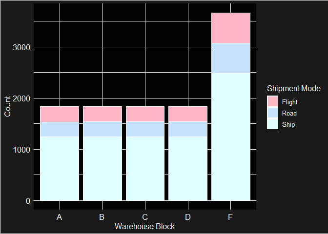

## Customer rating

### Breakdown of orders for each customer rating score

    tibble(
      '1' = sum(shippingdf$customer_rating == "1"),
      '2' = sum(shippingdf$customer_rating == "2"),
      '3' = sum(shippingdf$customer_rating == "3"),
      '4' = sum(shippingdf$customer_rating == "4"),
      '5' = sum(shippingdf$customer_rating == "5"),
    )

    ## # A tibble: 1 × 5
    ##     `1`   `2`   `3`   `4`   `5`
    ##   <int> <int> <int> <int> <int>
    ## 1  2235  2165  2239  2189  2171

### Summary of customer ratings

    summary(shippingdf$customer_rating)

    ##    Min. 1st Qu.  Median    Mean 3rd Qu.    Max. 
    ##   1.000   2.000   3.000   2.991   4.000   5.000

### Average customer ratings for each warehouse block and mode of shipment

    ratingswh <- aggregate(customer_rating ~ warehouse_block, shippingdf, function(x) round(mean(x), 2))
    warehousecolours <- c("cadetblue2", "honeydew3", "lightsteelblue1", "mistyrose1", "thistle2")
    p2 <- ggplot(ratingswh, aes(x = warehouse_block, y = sprintf("%.2f", customer_rating))) +
      geom_point(colour = warehousecolours, size = 4) +
      scale_colour_manual(values = warehousecolours) +
      labs(x = "Warehouse Block", y = "Average Customer Rating") +
      theme(plot.background = element_rect(fill = "gray10"),
            panel.background = element_rect(fill = "grey1"),
            text = element_text(family = "Arial", color = "white", size = 12),
            axis.text = element_text(family = "Arial", color = "white", size = 12))

    ratingsshipment <- aggregate(customer_rating ~ mode_of_shipment, shippingdf, function(x) round(mean(x), 2))
    p3 <-ggplot(ratingsshipment, aes(x = mode_of_shipment, y = sprintf("%.2f", customer_rating))) + 
      geom_point(colour = shipmentcolour, size = 4) +
      scale_colour_manual(values = shipmentcolour) +
      labs(x = "Mode of Shipment", y = "Average Customer Rating") +
      theme(plot.background = element_rect(fill = "gray10"),
            panel.background = element_rect(fill = "grey1"),
            text = element_text(family = "Arial", color = "white", size = 12),
            axis.text = element_text(family = "Arial", color = "white", size = 12)) 

    combined1 <- p2 + p3 + plot_layout(ncol = 2, widths = c(8,8))
    combined1

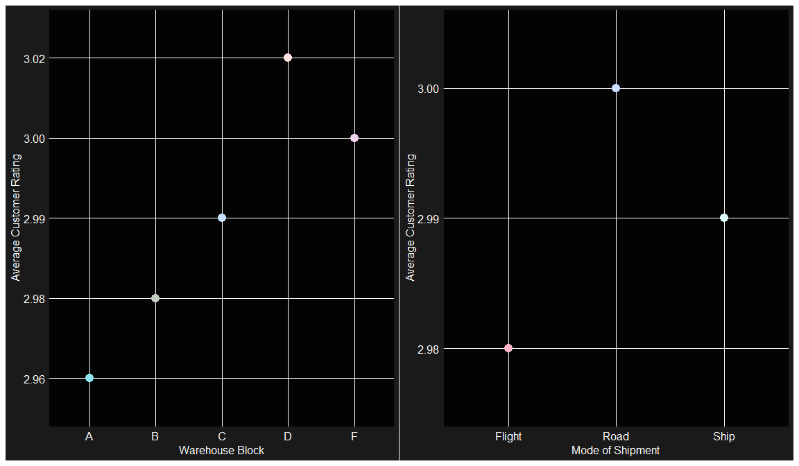

## Product punctuality and importance

### Average customer ratings based on punctuality of shipment

    aggregate(customer_rating ~ punctuality, shippingdf, function(x) round(mean(x),2))

    ##   punctuality customer_rating
    ## 1           0            2.97
    ## 2           1            3.01

### Breakdown of orders by punctuality

    tibble(
      On_time = sum(shippingdf$punctuality == "0"),
      Late = sum(shippingdf$punctuality == "1")
    )

    ## # A tibble: 1 × 2
    ##   On_time  Late
    ##     <int> <int>
    ## 1    4436  6563

### Breakdown of orders by product importance

    tibble(
      Low = sum(shippingdf$product_importance == "Low"), 
      Medium = sum(shippingdf$product_importance == "Medium"),
      High = sum(shippingdf$product_importance == "High"),
    )

    ## # A tibble: 1 × 3
    ##     Low Medium  High
    ##   <int>  <int> <int>
    ## 1  5297   4754   948

### Punctuality of shipment of each warehouse block

    shippingdf %>%  
      group_by(warehouse_block, punctuality) %>%  
      summarise(count = n()) %>%  
      ungroup %>%  
      group_by(warehouse_block) %>% 
      mutate(percentage = round((count/sum(count))* 100, 2))

    ## `summarise()` has grouped output by 'warehouse_block'. You can override using
    ## the `.groups` argument.

    ## # A tibble: 10 × 4
    ## # Groups:   warehouse_block [5]
    ##    warehouse_block punctuality count percentage
    ##    <chr>                 <int> <int>      <dbl>
    ##  1 A                         0   758       41.4
    ##  2 A                         1  1075       58.6
    ##  3 B                         0   729       39.8
    ##  4 B                         1  1104       60.2
    ##  5 C                         0   739       40.3
    ##  6 C                         1  1094       59.7
    ##  7 D                         0   738       40.2
    ##  8 D                         1  1096       59.8
    ##  9 F                         0  1472       40.2
    ## 10 F                         1  2194       59.8

### Distribution of orders based on punctuality and product importance for each warehouse

    punctualitycolour <- c("honeydew1", "indianred")
    p4 <- ggplot(shippingdf, aes(x = warehouse_block, fill = as.character(punctuality))) +
      geom_bar(colour = "white", size = 0.5) +
      scale_fill_manual(values = punctualitycolour, labels = c("On Time", "Late")) +
      labs(x = "Warehouse Block", y = "Count", fill = "Punctuality") +
      theme(plot.background = element_rect(fill = "grey10"),
            panel.background = element_rect(fill = "grey1"),
            legend.background = element_rect(fill = "grey10"),
            text = element_text(family = "Arial", color = "white", size = 12),
            axis.text = element_text(family = "Arial", color = "white", size = 12))

    importancecolour <- c("lemonchiffon1","rosybrown1","indianred1")
    p5 <- ggplot(shippingdf, aes(x = warehouse_block, fill = product_importance)) + 
      scale_fill_manual(values = importancecolour) +
      geom_bar(colour = "white", size = 0.5) +
      labs(x = "Warehouse Block", y = "Count", fill = "Product Importance")+
      theme(plot.background = element_rect(fill = "grey10"),
            panel.background = element_rect(fill = "grey1"),
            legend.background = element_rect(fill = "grey10"),
            text = element_text(family = "Arial", color = "white", size = 12),
            axis.text = element_text(family = "Arial", color = "white", size = 12))

    combined2 <- p4 + p5 + plot_layout(ncol = 2, widths = c(5,5))
    combined2

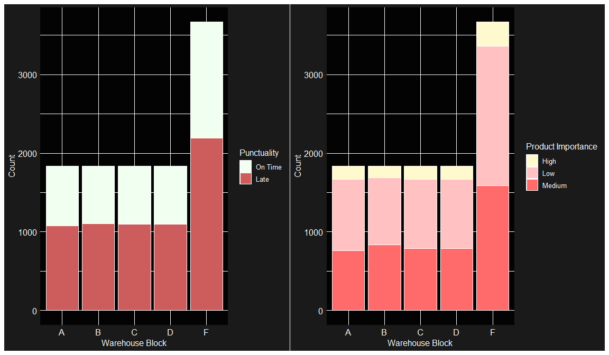

### Punctuality of each mode of shipment

    shippingdf %>% 
      group_by(mode_of_shipment, punctuality) %>%  
      summarise(count = n()) %>%  
      ungroup() %>% 
      group_by(mode_of_shipment) %>% 
      mutate(percentage = round(count/sum(count)*100,2))

    ## `summarise()` has grouped output by 'mode_of_shipment'. You can override using
    ## the `.groups` argument.

    ## # A tibble: 6 × 4
    ## # Groups:   mode_of_shipment [3]
    ##   mode_of_shipment punctuality count percentage
    ##   <chr>                  <int> <int>      <dbl>
    ## 1 Flight                     0   708       39.8
    ## 2 Flight                     1  1069       60.2
    ## 3 Road                       0   725       41.2
    ## 4 Road                       1  1035       58.8
    ## 5 Ship                       0  3003       40.2
    ## 6 Ship                       1  4459       59.8

### Breakdown of orders by product importance for each mode of shipment

    productorder <- c("Low", "Medium", "High")
    shippingdf$product_importance <- factor(shippingdf$product_importance, levels = productorder)
    shippingdf %>%  
      group_by(mode_of_shipment, product_importance) %>% 
      summarise(count = n()) %>%  
      ungroup() %>%  
      group_by(mode_of_shipment) %>% 
      mutate(percentage = round((count / sum(count)) * 100, 2))

    ## `summarise()` has grouped output by 'mode_of_shipment'. You can override using
    ## the `.groups` argument.

    ## # A tibble: 9 × 4
    ## # Groups:   mode_of_shipment [3]
    ##   mode_of_shipment product_importance count percentage
    ##   <chr>            <fct>              <int>      <dbl>
    ## 1 Flight           Low                  838      47.2 
    ## 2 Flight           Medium               776      43.7 
    ## 3 Flight           High                 163       9.17
    ## 4 Road             Low                  857      48.7 
    ## 5 Road             Medium               745      42.3 
    ## 6 Road             High                 158       8.98
    ## 7 Ship             Low                 3602      48.3 
    ## 8 Ship             Medium              3233      43.3 
    ## 9 Ship             High                 627       8.4

### Distribution of orders based on punctuality and product importance for each mode of shipment

    p6 <- ggplot(shippingdf, aes(x = mode_of_shipment, fill = as.character(punctuality))) +
      geom_bar(colour = "white", size = 0.5) +
      scale_fill_manual(values = punctualitycolour, labels = c("On Time", "Late")) +
      labs(x = "Mode of Shipment", y = "Count", fill = "Punctuality") +
      theme(plot.background = element_rect(fill = "grey10"),
            panel.background = element_rect(fill = "grey1"),
            legend.background = element_rect(fill = "grey10"),
            text = element_text(family = "Arial", color = "white", size = 12),
            axis.text = element_text(family = "Arial", color = "white", size = 12))

    p7 <- ggplot(shippingdf, aes(x = mode_of_shipment, fill = product_importance)) +
      scale_fill_manual(values = importancecolour) +
      geom_bar(colour = "white", size = 0.5) +
      labs(x = "Mode of Shipment", y = "Count", fill = "Product Importance") +
      theme(plot.background = element_rect(fill = "grey10"),
            panel.background = element_rect(fill = "grey1"),
            legend.background = element_rect(fill = "grey10"),
            text = element_text(family = "Arial", color = "white", size = 12),
            axis.text = element_text(family = "Arial", color = "white", size = 12))

    combined3 <- p6 + p7 + plot_layout(ncol = 2)

    combined3

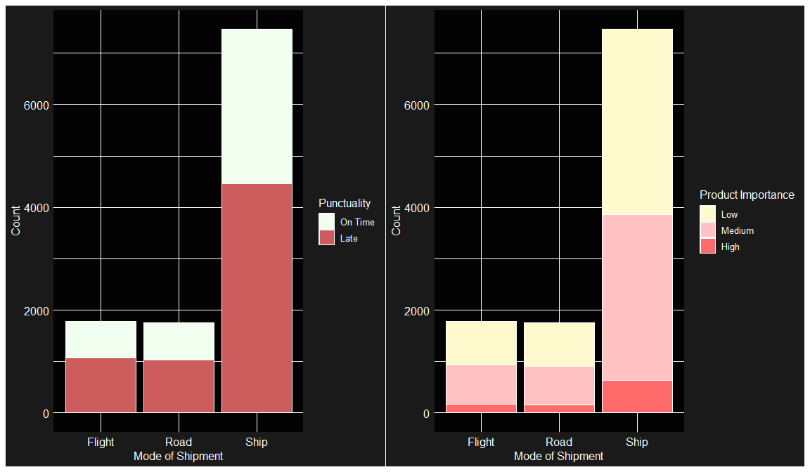

### Breakdown of orders by product importance and punctuality

    shippingdf %>%  
      group_by(product_importance, punctuality) %>%  
      summarise(count = n()) %>% 
      ungroup() %>% 
      group_by(product_importance) %>% 
      mutate(percent = round(count/sum(count)*100, 2))

    ## `summarise()` has grouped output by 'product_importance'. You can override
    ## using the `.groups` argument.

    ## # A tibble: 6 × 4
    ## # Groups:   product_importance [3]
    ##   product_importance punctuality count percent
    ##   <fct>                    <int> <int>   <dbl>
    ## 1 Low                          0  2157    40.7
    ## 2 Low                          1  3140    59.3
    ## 3 Medium                       0  1947    41.0
    ## 4 Medium                       1  2807    59.0
    ## 5 High                         0   332    35.0
    ## 6 High                         1   616    65.0

### Distribution of orders by product importance and punctuality

    ggplot(shippingdf, aes(x = product_importance, fill = as.character(punctuality))) +
      geom_bar(colour = "white", size = 0.5) +
      scale_fill_manual(values = punctualitycolour, labels = c("On Time", "Late")) +
      labs(x  = "Product Importance", y = "Count", fill = "Punctuality") +
      theme(plot.background = element_rect(fill = "grey10"),
            panel.background = element_rect(fill = "grey1"),
            legend.background = element_rect(fill = "grey10"),
            text = element_text(family = "Arial", color = "white", size = 12),
            axis.text = element_text(family = "Arial", color = "white", size = 12))

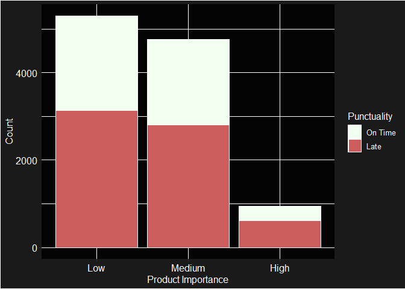

## Customer Calls

### Summary of customer care calls

    summary(shippingdf$customer_care_calls)

    ##    Min. 1st Qu.  Median    Mean 3rd Qu.    Max. 
    ##   2.000   3.000   4.000   4.054   5.000   7.000

### Count of customer care calls for each warehouse block

    totalcalls <- aggregate(customer_care_calls ~ warehouse_block, data = shippingdf, FUN = sum)
    ggplot(totalcalls, aes(x = warehouse_block, y = customer_care_calls, fill = warehousecolours)) + 
      geom_bar(stat = "identity", colour = "white", size = 0.5) +
      scale_fill_manual(values = warehousecolours) +
      labs(x = "Warehouse Block", y = "Count of Customer Care Calls") +
      theme(plot.background = element_rect(fill = "grey10"),
            panel.background = element_rect(fill = "grey1"),
            legend.background = element_rect(fill = "grey10"),
            text = element_text(family = "Arial", color = "white", size = 12),
            axis.text = element_text(family = "Arial", color = "white", size = 12)) + 
      guides(fill = FALSE)

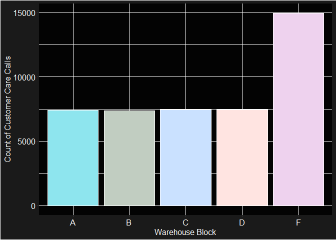

### Count of customer care calls for each warehouse block

    totalcallsshipment <- aggregate(customer_care_calls ~ mode_of_shipment, data = shippingdf, FUN =sum)
    ggplot(totalcallsshipment, aes(x = mode_of_shipment, y = customer_care_calls, fill = shipmentcolour)) + 
      geom_bar(stat = "identity", colour = "white", size = 0.5) +
      scale_fill_manual(values = shipmentcolour) +
      labs(x = "Warehouse Block", y = "Count of Customer Care Calls") +
      theme(plot.background = element_rect(fill = "grey10"),
            panel.background = element_rect(fill = "grey1"),
            legend.background = element_rect(fill = "grey10"),
            text = element_text(family = "Arial", color = "white", size = 12),
            axis.text = element_text(family = "Arial", color = "white", size = 12)) + 
      guides(fill = FALSE)

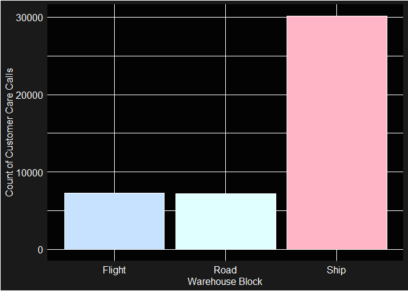

## Product costs

### Summary of cost of products

    summary(shippingdf$cost_of_the_product)

    ##    Min. 1st Qu.  Median    Mean 3rd Qu.    Max. 
    ##    96.0   169.0   214.0   210.2   251.0   310.0

### Count of orders by product price range for each mode of shipment

    breaks <- c(0, 99, 199, 299, Inf)
    labels <- c("$99 & Below", "$100 - $199", "$200 - $299", "$300 & Above")
    shippingdf$cost_of_the_product_range <- cut(shippingdf$cost_of_the_product, breaks = breaks, labels = labels, include.lowest = TRUE)
    pricerangecolour <- c("lightcyan1", "lavender", "lightpink1", "lemonchiffon1")
    ggplot(shippingdf, aes(x = mode_of_shipment, fill = cost_of_the_product_range)) +
      geom_bar(colour = "white", size = 0.5) +
      scale_fill_manual(values = pricerangecolour) +
      labs(x = "Mode of Shipment", y = "Count", fill = "Product Price Range") +
      theme(plot.background = element_rect(fill = "grey10"),
            panel.background = element_rect(fill = "grey1"),
            legend.background = element_rect(fill = "grey10"),
            text = element_text(family = "Arial", color = "white", size = 12),
            axis.text = element_text(family = "Arial", color = "white", size = 12))

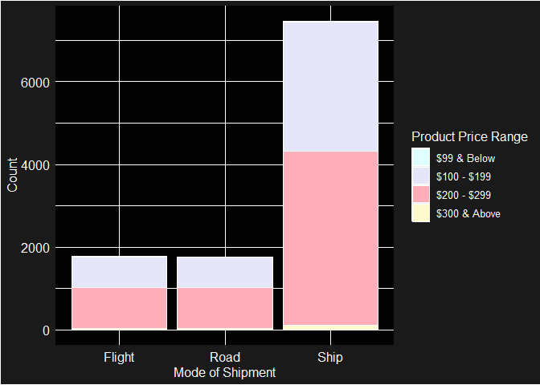

# Discount offered

### Summary of discount offered

    summary(shippingdf$discount_offered)

    ##    Min. 1st Qu.  Median    Mean 3rd Qu.    Max. 
    ##    1.00    4.00    7.00   13.37   10.00   65.00

### Distribution of orders by discount range

    breaks2 <- c(0, 5, 10, 20, 30, 40, 50, 60 , 70)
    discountlabels <- c("5% & Below", "6% to 10%", "11% to 20%", "21% to 30%", 
                        "31% to 40%", "41% to 50%", "51% to 60%", "61% to 70%")
    shippingdf$discount_offered_range <- cut(shippingdf$discount_offered, breaks = breaks2, labels = discountlabels, include.lowest  = TRUE)
    discountcolours <- c("cornsilk", "azure3", "slategray4","mistyrose2", "paleturquoise2", "lavenderblush", "thistle2", "grey")
    ggplot(shippingdf, aes(x = discount_offered_range)) + 
      geom_bar(colour = "white", size = 0.5, fill = discountcolours) +
      scale_fill_manual(values = discountcolours) +
      labs(x  = "Discount", y = "Count") +
      theme(plot.background = element_rect(fill = "grey10"),
            panel.background = element_rect(fill = "grey1"),
            legend.background = element_rect(fill = "grey10"),
            text = element_text(family = "Arial", color = "white", size = 12),
            axis.text = element_text(family = "Arial", color = "white", size = 12),
            axis.text.x = element_text(angle = 45, hjust = 1))

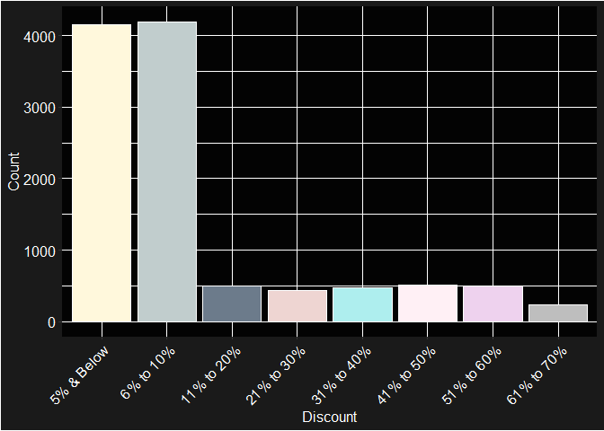

### Average customer ratings across different discount range

    discountrating <- aggregate(customer_rating ~ discount_offered_range, shippingdf, function(x) round(mean(x),2))
    ggplot(discountrating, aes(x = discount_offered_range, y = customer_rating)) + 
      geom_point(colour = discountcolours, size = 4) +
      scale_colour_manual(values = discountcolours) + 
      labs(x = "Discount", y = "Average Customer Rating") +
      theme(plot.background = element_rect(fill = "grey10"),
            panel.background = element_rect(fill = "grey1"),
            legend.background = element_rect(fill = "grey10"),
            text = element_text(family = "Arial", color = "white", size = 12),
            axis.text = element_text(family = "Arial", color = "white", size = 12),
            axis.text.x = element_text(angle = 45, hjust = 1))

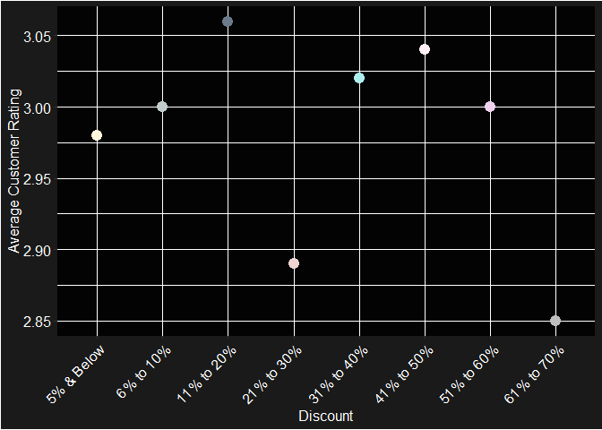

### Weight

### Summary of weight of products

    summary(shippingdf$weight_in_gms)

    ##    Min. 1st Qu.  Median    Mean 3rd Qu.    Max. 
    ##    1001    1840    4149    3634    5050    7846

### Distribution of product weights by mode of shipment

    breaks3 <- c(0, 999, 1999, 2999, 3999, 4999, 5999, 6999, Inf)
    weightlabels <- c("999g & Below", "1000g to 1999g", "2000g to 2999g", "3000g to 3999g", "4000g to 4999g", 
                      "5000g to 5999g", "6000g to 6999g", "7000g & Above")
    shippingdf$weight_range <- cut(shippingdf$weight_in_gms, breaks = breaks3, labels = weightlabels, include.lowest = TRUE)
    ggplot(shippingdf, aes(x = weight_range, fill = mode_of_shipment)) +
      geom_bar(colour = "white", size = 0.5) + 
      scale_fill_manual(values = shipmentcolour) +
      labs(x = "Weight Range", fill = "Mode of Shipment") +
      theme(plot.background = element_rect(fill = "grey10"),
            panel.background = element_rect(fill = "grey1"),
            legend.background = element_rect(fill = "grey10"),
            text = element_text(family = "Arial", color = "white", size = 12),
            axis.text = element_text(family = "Arial", color = "white", size = 12),
            axis.text.x = element_text(angle = 45, hjust = 1))

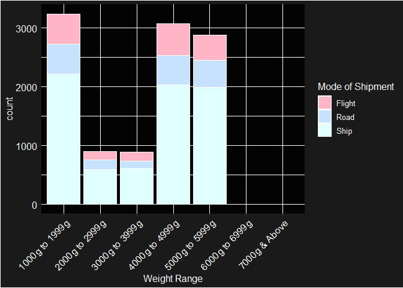

## Prior purchases

### Summary of customer’s prior purchases

    summary(shippingdf$prior_purchases)

    ##    Min. 1st Qu.  Median    Mean 3rd Qu.    Max. 
    ##   2.000   3.000   3.000   3.568   4.000  10.000

# Evaluation

It seems that there is no clear preference for a specific mode of
shipment based on product weight, importance, or price. Therefore,
factors such as shipment costs, available modes of shipment during
checkout, and the convenience of the shipment method may influence the
preference for a particular mode of shipment. Further research is
warranted to gain deeper insights into this matter.

Moreover, a comprehensive investigation into logistics management across
all warehouses is imperative due to the prevalence of late shipments
outnumbering on-time deliveries. This concern is particularly pronounced
for Warehouse B, which exhibits the highest proportion of late shipments
despite having one of the lowest total order volumes. Additionally,
although shipping by ship is the primary mode of transportation for the
highest volume of orders, shipments by flight experience a higher
proportion of late deliveries compared to on-time deliveries. Further
investigation is required to identify the underlying factors
contributing to these discrepancies.

Furthermore, additional research is needed to ascertain the factors
influencing customer ratings.

# Conclusion

As the trend towards online shopping continues to grow, there is a
pressing need for shipment and logistics companies to enhance their
operational efficiencies in order to manage the rising volume of orders
effectively. Given the lucrative nature of the shipment and logistics
industry and the substantial benefits it offers, investing in
improvements to efficiency is highly advantageous.
